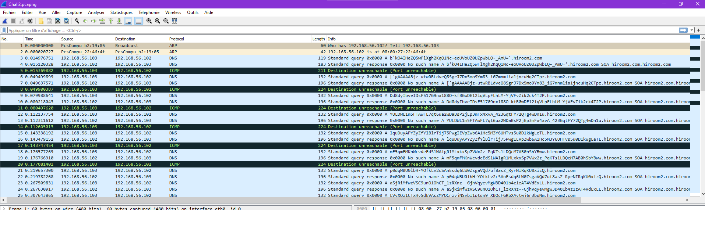
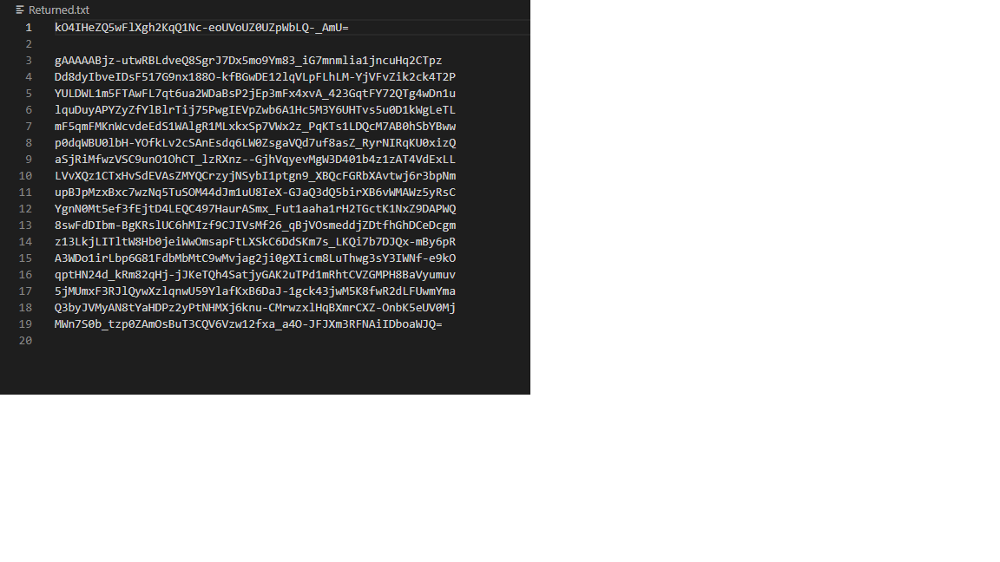
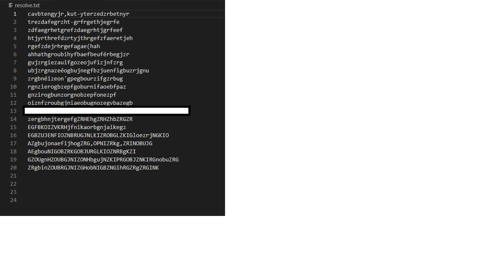

# Write-UP 

## Ouverture du fichier PCAPNG

Possibiliter d'ouvrir le fichier avec Wireshark pour comprendre l'objectif : 



## Récupération

On utilise Python et la suite Scapy pour récupérer le fichier chiffré : 

```python
from scapy.all import *
from scapy.layers.dns import DNS, DNSQR

with open('Returned.txt', 'w') as Returned:

    dns_packets = rdpcap('Chall2.pcapng')
    for packet in dns_packets:
        if packet.haslayer(DNS):
            #print(packet["DNS"])
            if packet["DNS"].qr == 0:
                record = str(packet["DNS Question Record"].qname)
                Domain = record[:-14]
                writtings = Domain.strip("b'").strip("'").strip("']").strip("\"['").strip("\"b'")
                print(writtings)
                Returned.write(writtings)
                Returned.write("\n")

```
## _A quoi ça sert ?_

- Import de Scapy
- Ouverture du Pcap
- Lecture des paquets 
- Récupération des paquets DNS
- Mise en forme des champs récupérés pour faciliter le déchiffrement
- Écriture dans un nouveau fichier de la sortie


## Fichier de sortie



## Récupération de la Clé

On remarque que la première ligne est la clé, donc, on l'isole : 

```python
with open("Returned.txt", "r") as f:
    data = f.readlines()
    key = data[0]
    with open("resolve.txt", "w") as f:
        f.writelines(data[1:])
```
On mets également le reste dans un second fichier, qui sera lui-même déchiffré.

## Déchiffrement

Le déchiffrement se fait en utilisant **fernet** de cryptography, qui est la suite de base de cryptography de Python

**Script Complet**


```python
from cryptography.fernet import Fernet

# récupération et stockage de la clé pour Fernet

with open("Returned.txt", "r") as f:
    data = f.readlines()
    key = data[0]
    with open("resolve.txt", "w") as f:
        f.writelines(data[1:])

fernet = Fernet(key)
 
# ouverture du fichier
with open('resolve.txt', 'rb') as enc_file:
    encrypted = enc_file.read()
    #print(encrypted)
 
# decrypting the file
decrypted = fernet.decrypt(encrypted)
 
# opening the file in write mode and
# writing the decrypted data
with open('resolve.txt', 'wb') as dec_file:
    dec_file.write(decrypted)

```


## Fichier Final

Nous avons donc enfin accès au fichier final.



Le mot de passe a été retrouvé, félicitations.

